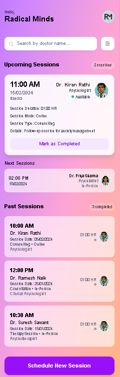

# Doctor Appointment Booking Platform

A modern web application built with Next.js and Tailwind CSS for booking doctor appointments by selecting date and time. Users can browse associated doctors, schedule sessions with patient details, and manage upcoming and past appointments through a user-friendly dashboard.

---

## 🚀 Features

- **Doctor Directory:** View doctors with their specializations and session fees.
- **Search & Filter:** Quickly search and filter doctors by name, specialization, gender, session type, and mode.
- **Book Appointments:** Schedule sessions including date, time, contact info (WhatsApp, email), and session type.
- **Dashboard:** Manage upcoming and past sessions with full details.
- **Session Management:** Mark sessions as completed.
- **Responsive Design:** Optimized for both desktop and mobile devices.
- **No Backend Required:** Runs fully on local mock/static data, no database or APIs.

---

## 📸 Screenshots

## 🛠 Technology Stack

- Next.js (App Router)
- React (with hooks and functional components)
- TypeScript
- Tailwind CSS
- Heroicons

## 💻 Prerequisites

- Node.js (recommend v18.x or newer)
- npm (comes with Node.js)
- Git (to clone repository)

_No database or environment variables needed._

---

## ⚡ Installation and Running

### 1. Clone the repository

git clone <your-repo-url>
cd <your-project-folder>

### 2. Install dependencies

npm install

### 3. Run development server

npm run dev
Open your browser and visit [http://localhost:3000/dashboard](http://localhost:3000/dashboard).

### 4. Build for production (optional)

npm run build
npm start

---

## 📁 Project Structure

.
├── app/
│ ├── dashboard/
│ ├── available-doctors/
│ ├── patient-details/
│ ├── schedule-session/
│ └── ...
├── model/
│ ├── doctor-model/
│ └── session-model/
├── public/
│ ├── logo_RM.png
│ ├── male_doctor.png
│ └── female_doctor.png
├── styles/
│ └── globals.css
├── package.json
├── next.config.ts
├── tsconfig.json
└── README.md

---

## 🔍 How to Use

- **Dashboard:** View, search, and filter all your upcoming and past appointments.
- **Available Doctors:** Browse, search, and filter doctors.
- **Schedule Session:** Book an appointment by providing necessary details.
- **Mark Completed:** Update session status to completed.

---Enjoy your Doctor Appointment Booking Platform! 👨‍⚕️👩‍⚕️
